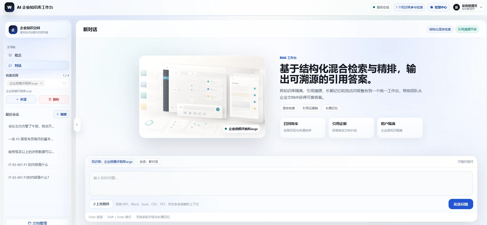
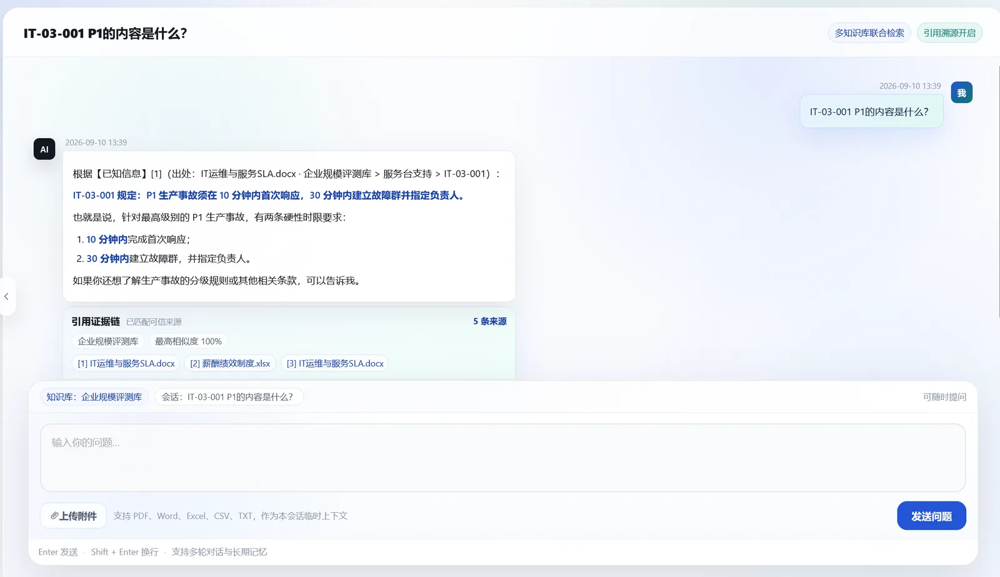
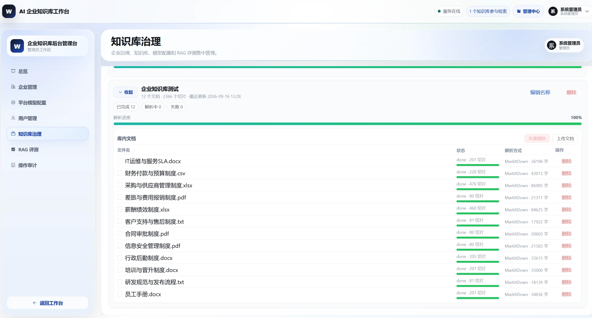
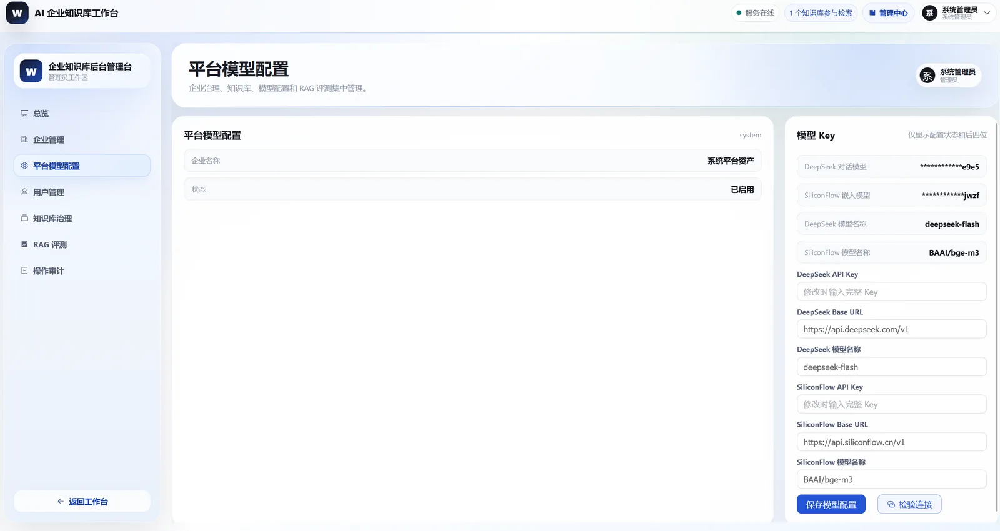
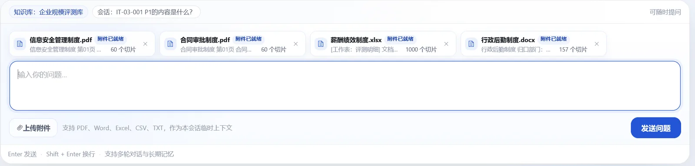
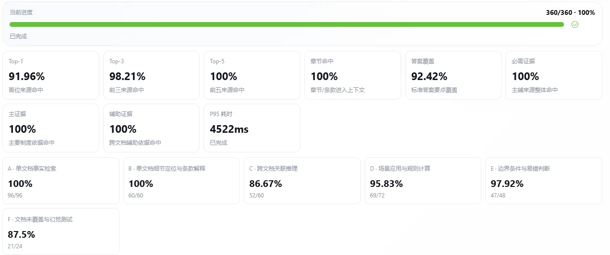
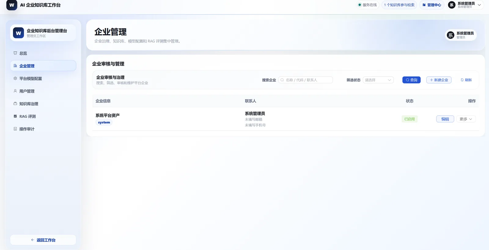
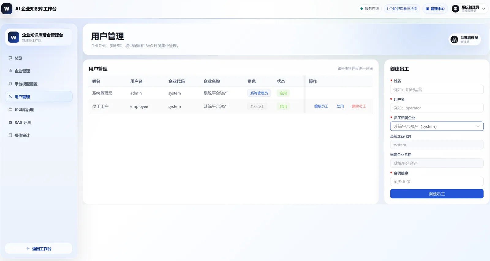

# RAG Business Chat

**企业 AI 知识库工作台**

多企业隔离 · 结构化 RAG · 引用溯源 · 会话附件理解 · 360 题评测闭环

　用体验账号登录，<b>直接在线提问</b> 
　点开查看<b>平台展示页与检索链路</b>

## 项目描述

企业内部的知识、规定和流程，大多沉淀在各类文档里。员工想确认一件事，往往要先翻好几个文件，还不一定找得到最新、最权威的那一条。

这套系统把企业文档变成一个可以直接提问的知识库：管理员上传文档，员工用日常说话的方式提问，系统检索出对应内容、生成回答，并且**每条结论都附上引用来源**，可以点回原文核对；知识库里没有依据时明确说明未覆盖，不编造。企业之间完全隔离，各自的文档、会话、附件和模型 Key 互不可见。

从文档解析、结构化切片到混合检索与引用溯源，检索采用向量与关键词双通道融合、cross-encoder 精排；服务端 FastAPI + LangChain，向量存 Milvus，前端 Vue 3。**整套可运行、可评测、可隔离。**

## 界面预览

| 问答工作台 | 带引用证据链的回答 |
| --- | --- |
|  |  |
| 企业员工提问，支持附件与多轮追问 | 引用编号与来源区一一对应，可查看命中的知识库、文件名、片段与相似度 |

| 知识库治理 | 模型配置 |
| --- | --- |
|  |  |
| 解析状态、切片数量与失败原因直接可见，支持批量删除 | Key 按企业加密保存、遮罩展示，保存与连接测试分离 |

| 会话附件 | RAG 评测中心 |
| --- | --- |
|  |  |
| 附件只在当前账号当前会话内参与回答，与知识库来源分组展示 | 题集管理、运行模式、逐题诊断与报告导出，任务按企业隔离 |

| 平台企业治理 | 企业用户管理 |
| --- | --- |
|  |  |
| 企业审核、启用禁用与软删除，治理动作全部写入审计日志 | 员工账号的创建、启停与角色分配，全部按企业隔离 |

> 更多界面与检索链路说明见[项目展示页](https://jizhualiuliubei.github.io/RAG-Business-chat/)——点开是一个网页，图文介绍界面与实现，不用登录。

## 核心能力

| 能力 | 说明 |
| --- | --- |
| **多企业 SaaS** | 系统管理员、企业管理员、企业员工三类角色。企业注册、审核、启用禁用与软删除形成完整闭环，文档、会话、附件、评测任务与模型 Key 全部按企业隔离。 |
| **制度问答与引用溯源** | 用日常说法提问即可，系统检索出对应条款并生成回答，结论附 `[n]` 编号引用，能对回具体文件与片段。库里没有依据时明确说明未覆盖，不编造。 |
| **知识库与文档治理** | 支持 DOCX、PDF、扫描 PDF（OCR）、TXT、CSV、XLSX、XLS。上传后自动解析、切片、入库；解析状态、切片数量与失败原因在后台直接可见，删除文档时同步清理向量。 |
| **模型配置** | 对话模型与嵌入模型的 Key 按企业配置、加密保存、遮罩展示，支持连接测试，并按企业路由。 |
| **会话附件** | 提问时可以临时上传附件，只属于当前账号当前会话，不进入企业知识库，来源与知识库证据分组展示。 |
| **RAG 评测中心** | 内置 360 题企业语料题集，支持检索评测、主评测、RAGAS 诊断三种模式，出逐题失败原因并可导出报告，任务与报告按企业隔离。 |
| **审计中心** | 企业审核、状态变更、Key 更新、文档与评测删除等关键动作可追踪。 |

## 效果指标

在自建的 360 题企业规模题集（12 份仿真制度文档）上，`rules` 模式主评测结果：

| 指标 | 结果 |
| --- | ---: |
| **端到端通过率**（不补召回，用户真实路径） | **93.89%** |
| 主评测总通过率（补召回后，诊断上限） | **97.78%** |
| 证据 Top-5 可用率 | **100.0%** |
| 评测题集 | **360 题**（A 到 F 六类题型） |

> 题集为**仿真企业语料自建**，不代表所有场景，也不能与公开基准直接比较；完整口径、题型分布与失败归因见[项目展示页](https://jizhualiuliubei.github.io/RAG-Business-chat/)的评测章节。对外讲能力以「端到端通过率」为准——它只用真实检索到的证据判定；「总通过率」是补召回之后的诊断上限。

## 快速开始

### 在线体验

**地址**：[http://118.31.45.253/](http://118.31.45.253/)

#### 方式一：用体验账号直接看效果

1. 打开上面的地址，进入登录页。
2. 企业代码填 `system`，用户名填 `employee`，密码填 `employee123`，再输入算式验证码。
3. 点「登录工作台」进入问答页。
4. 在输入框里提一个制度类问题（考勤、报销、审批权限这类都可以）。
5. 看回答正文里的 `[1]`、`[2]` 编号，以及下方的引用来源区——每条编号都能对回具体的知识库、文件名、命中的片段和相似度。

| 企业代码 | 用户名 | 密码 | 角色 |
| --- | --- | --- | --- |
| `system` | `employee` | `employee123` | 员工体验账号，只能进入问答工作台 |

> 体验账号是只读的，看不到管理后台。公开演示环境的账号与数据仅用于功能体验。

#### 方式二：注册自己的企业，走一遍完整流程

如果你想把整套流程走通（建知识库、传文档、配模型），按下面几步来：

1. **提交注册申请**：登录页底部点「企业管理员注册申请」，在弹出的表单里填写：

   | 字段 | 是否必填 | 说明 |
   | --- | --- | --- |
   | 企业名称 | 必填 | 例如「xxx有限公司」 |
   | 企业代码 | 必填 | 登录时使用，例如 `xx-xxxxx` |
   | 管理员用户名 | 必填 | 审核通过后用于登录 |
   | 管理员显示名 | 必填 | 例如「企业管理员」 |
   | 密码 | 必填 | 至少 6 位 |
   | 联系人 / 邮箱 / 手机号 | 选填 | 用于审核联系 |

2. **等待审核**：提交后企业和管理员账号都处于**待审核**状态，此时还不能登录。平台管理员在「企业治理」里审核通过后，企业才会启用。

3. **登录管理中心**：用「企业代码 + 管理员用户名 + 密码」登录。企业管理员登录后进入管理中心，而不是问答工作台。

4. **配置模型 Key**：进「企业设置」，填入对话模型与嵌入模型的 Key，点「连接测试」确认可用。**没有配 Key 无法问答**。

5. **建设知识库**：进「知识库治理」，新建一个知识库，然后上传文档——支持 DOCX、PDF、扫描版 PDF（自动 OCR）、TXT、CSV、XLSX、XLS。上传后系统会自动解析、切片并写入向量库，页面上的解析状态和切片数量会实时更新，失败原因也会直接显示。

6. **回到问答工作台提问**：文档解析完成后，在问答页选中刚才的知识库提问，回答会带上引用来源。

7. **（可选）给同事开账号**：在「企业用户管理」里创建员工账号并分配角色，员工登录后只能看到问答工作台。

> 演示环境的注册需要平台管理员**审核**，不会自动通过。

## 技术栈

**后端** FastAPI · LangChain 1.2 · SQLAlchemy · Pydantic
**模型** DeepSeek（对话与查询改写）· BGE-M3（向量化）· bge-reranker-v2-m3（重排）
**文档解析** Microsoft MarkItDown（主解析）· python-docx / pypdf / openpyxl（降级）· Tesseract OCR（扫描件）
**存储** Zilliz / Milvus（向量）· SQLite / MySQL（关系）· MCP（外部工具）
**前端** Vue 3 · Element Plus · Vite

---

**▶ [在线体验](http://118.31.45.253/)**　·　**📄 [项目展示页](https://jizhualiuliubei.github.io/RAG-Business-chat/)**

在线体验：打开线上系统，用体验账号直接提问　｜　项目展示页：打开网页看图文介绍

