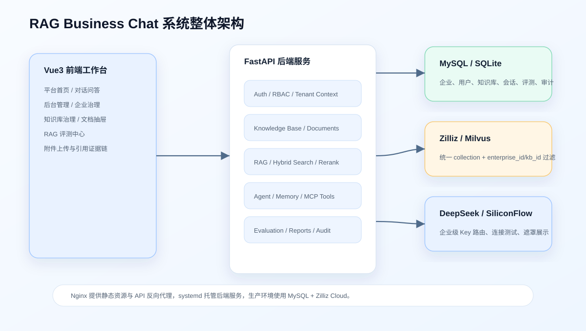
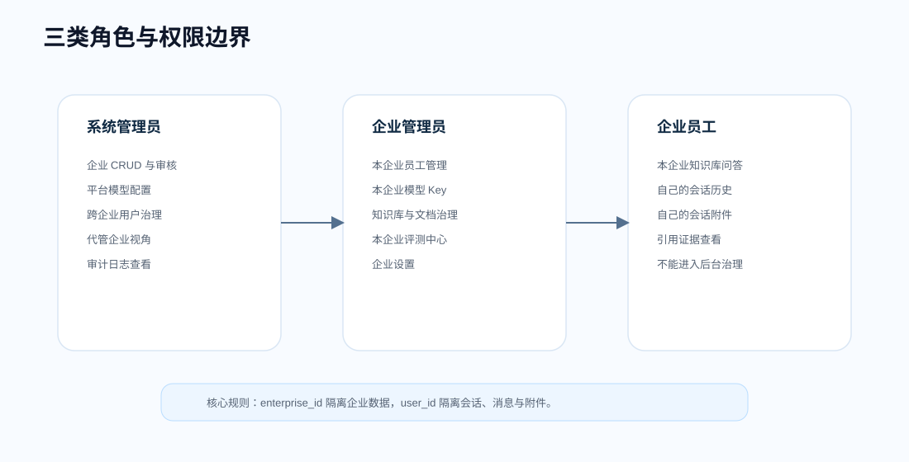
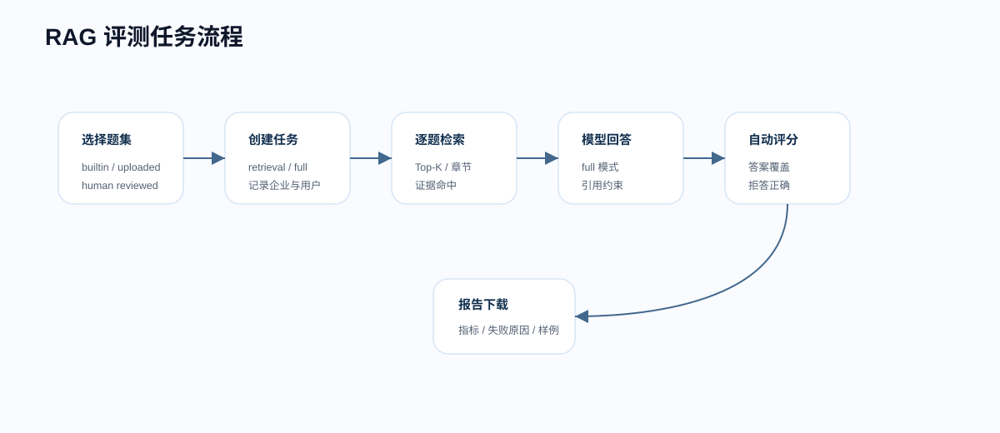

# RAG Business Chat · 企业级 AI 知识库工作台



RAG Business Chat 是一个面向企业知识管理场景的 AI 工作台。它把多企业 SaaS、企业文档治理、RAG 问答、会话附件理解、Agent 工具调用、模型 Key 路由、权限隔离、审计日志和 RAG 评测中心组合成一套完整系统。

项目关注的不是“把文档塞给大模型”这么简单，而是企业制度问答中更真实的问题：文档格式复杂、条款编号很短、表格信息难检索、跨文档问题容易漏证据、不同企业数据必须隔离、模型 Key 不能写死在代码里、系统需要能评测和复盘。

线上体验：[http://118.31.45.253/](http://118.31.45.253/)

静态展示页：[showcase/index.html](showcase/index.html)

## 项目解决什么问题

企业知识库通常包含员工手册、薪酬绩效、采购付款、合同审批、信息安全、研发发布、客户服务、差旅报销等制度资料。这类资料有几个共同特点：

- 用户提问经常带条款号、角色、金额、时间、流程节点等硬信息。
- 正确答案往往来自多个文档，单个 Top-K 向量结果不一定覆盖完整证据。
- 表格和扫描 PDF 很常见，解析质量会直接影响检索质量。
- 企业数据、员工会话、上传附件和模型 Key 都必须隔离。
- 问答效果需要可量化评测，不能只看几条演示样例。

RAG Business Chat 围绕这些问题实现了一套可运行的端到端方案。

## 核心能力

| 能力 | 说明 |
| --- | --- |
| 多企业 SaaS | 支持系统管理员、企业管理员、企业员工三类角色；企业注册审核、启用禁用、软删除、代管审计完整闭环。 |
| 企业级 Key 路由 | DeepSeek 对话模型和 SiliconFlow/BGE-M3 嵌入模型按企业配置、加密保存、遮罩展示、连接测试、按企业路由。 |
| 文档治理 | 支持 DOCX、PDF、扫描 PDF OCR、TXT、CSV、XLSX/XLS；上传后解析、结构化切片、向量入库、状态追踪。 |
| 结构化 RAG | 保留文档名、章节、条款号、页码/Sheet/行号；支持查询改写、混合检索、Rerank、多证据补召回和引用约束。 |
| 会话附件 RAG | 用户提问时上传的附件作为当前账号当前会话的临时知识，不入企业知识库，不被其他账号看到。 |
| Agent 能力 | 支持 `@tool` 本地工具、MCP 工具加载、用户档案读取、当前时间工具和 Agent RAG 扩展链路。 |
| 记忆机制 | 最近 N 轮历史窗口、LangGraph `InMemorySaver`、摘要压缩中间件和结构化长期用户档案组合使用。 |
| 评测中心 | 内置企业规模 360 题基准，覆盖 A-F 六类问题，支持 retrieval/full 模式、逐题诊断和 Markdown 报告。 |

## 系统架构


系统采用 Vue3 + FastAPI 前后端分离架构。前端负责工作台、后台管理、评测中心和交互展示；后端负责认证鉴权、企业上下文、文档解析、RAG 检索、模型调用、评测任务和审计日志。关系库使用 SQLite/MySQL 兼容设计，向量库使用 Zilliz/Milvus 统一 collection，并通过元数据过滤实现企业和知识库隔离。

详细说明：[docs/技术架构.md](docs/技术架构.md)

## RAG 设计


本项目的 RAG 链路由六个阶段组成：

1. 文档解析：读取 Word、PDF、扫描 PDF、TXT、CSV、Excel。
2. 结构化切片：抽取章节、条款号、页码、Sheet、行号，并写入 chunk 结构头。
3. 检索前优化：识别条款号、文档名、章节名，进行查询改写。
4. 检索中优化：向量检索、BM25、条款精确召回、元数据过滤并行工作。
5. 检索后优化：融合排序、去重、Rerank、多证据补召回。
6. 约束生成：区分知识库和附件来源，输出引用，证据不足时拒答。

切片参数默认 `CHUNK_SIZE=350`、`CHUNK_OVERLAP=80`。这是在制度类文档中取得的折中：太小会把条款和解释拆散，太大会让目录和开头块成为“万能候选”，增加误召回。

详细说明：[docs/RAG机制说明.md](docs/RAG机制说明.md)

## Agent 与记忆

项目中有三类 Agent 相关能力：

| 能力 | 位置 | 作用 |
| --- | --- | --- |
| 本地 `@tool` 工具 | `backend/app/core/rag_agent.py` | 把知识库检索、当前时间、用户档案封装为 Agent 可调用工具。 |
| MCP 工具 | `backend/app/core/mcp_agent.py` | 通过 MCP server 加载计算器、日期时间等外部工具。 |
| `ToolStrategy` 结构化输出 | `backend/app/core/memory_agent.py` | 从用户消息中提取姓名、称呼、身份、偏好，保存到用户档案。 |

记忆不是单一方案，而是组合方案：

- 最近 N 轮历史窗口：`HISTORY_ROUNDS=10`，控制上下文长度和成本。
- 会话检查点：LangGraph `InMemorySaver` 按 `thread_id = conversation_id` 隔离会话内记忆。
- 摘要压缩：`SummarizationMiddleware` 在消息超过阈值后摘要历史，保留最近 2 条原文。
- 长期用户档案：用户主动提供的个人信息通过 `ToolStrategy + Pydantic Schema` 提取后写入 `user_profile` 表。

详细说明：[docs/Agent机制说明.md](docs/Agent机制说明.md)

## 数据库与权限


数据库围绕多租户设计：`enterprise_id` 是企业级隔离边界，`user_id` 是会话、消息、附件隔离边界。系统平台资产本身也是一个企业资产，企业代码为 `system`。



详细说明：[docs/数据库设计.md](docs/数据库设计.md)

## 评测体系



内置 `enterprise_scale_360_v1` 基准题集包含 360 道题，覆盖：

| 类别 | 名称 | 重点 |
| --- | --- | --- |
| A | 单文档事实检索 | 基础事实命中 |
| B | 单文档细节定位与条款解释 | 条款、角色、金额、时间等硬信息 |
| C | 跨文档关联推理 | 主证据和辅助证据同时召回 |
| D | 场景应用与规则计算 | 把制度应用到业务场景 |
| E | 边界条件与易错判断 | 识别错误理解和例外条件 |
| F | 文档未覆盖与幻觉测试 | 无依据时拒答 |

当前 full 评测基线：

| 指标 | 结果 |
| --- | ---: |
| 总通过率 | 95.83% |
| Top-1 文档命中率 | 91.96% |
| Top-3 文档命中率 | 98.21% |
| Top-5 文档命中率 | 100.0% |
| 章节级命中率 | 100.0% |
| 答案要点覆盖率 | 92.42% |
| 必需证据命中率 | 100.0% |
| 主证据命中率 | 100.0% |
| 辅助证据命中率 | 100.0% |
| 引用正确率 | 100.0% |
| F 类拒答正确率 | 87.5% |
| 平均耗时 | 3461 ms |
| P95 耗时 | 4522 ms |
| Token 总量 | 570877 |

详细说明：[docs/评测体系.md](docs/评测体系.md)

## 默认体验账号

| 企业代码 | 用户名 | 密码 | 角色 |
| --- | --- | --- | --- |
| system | employee | employee123 | 系统员工体验账号 |
| system | admin | admin123 | 系统管理员 |

公开演示环境中的账号和数据仅用于功能体验。模型 Key、数据库密码、Zilliz Token 等敏感配置不要提交到仓库。

## 文档导航

| 文档 | 内容 |
| --- | --- |
| [使用说明](docs/使用说明.md) | 登录、企业管理、模型配置、知识库、问答、附件、评测中心操作说明。 |
| [技术架构](docs/技术架构.md) | 前后端、模型、向量库、数据库、部署和核心请求链路。 |
| [数据库设计](docs/数据库设计.md) | 数据表、字段、关系、企业隔离、软删除、模型 Key 和审计日志。 |
| [RAG 机制说明](docs/RAG机制说明.md) | 解析、切片、查询改写、混合检索、Rerank、多证据召回、拒答。 |
| [Agent 机制说明](docs/Agent机制说明.md) | `@tool`、MCP、ToolStrategy、记忆机制、Agent RAG 与手动 RAG。 |
| [评测体系](docs/评测体系.md) | 360 题基准、题型、指标口径、评测模式和当前结果。 |
| [部署说明](docs/部署说明.md) | 本地运行、线上部署、Nginx/systemd、环境变量和常见问题。 |

## 目录结构

```text
RAG-Business-chat/
├── backend/                 # FastAPI 后端服务
├── frontend/                # Vue3 前端应用
├── data/enterprise_scale/   # 合成企业制度文档
├── evaluation/              # 评测题集与基准数据
├── deploy/                  # Nginx、systemd、生产环境模板
├── docs/                    # 架构、数据库、RAG、Agent、评测文档
├── docs/images/             # 架构图与项目渲染图
├── showcase/                # 静态项目展示页
└── README.md
```

