

# 企业知识与事务智能体平台

**企业知识问答 · 引用溯源**

多企业隔离 · 结构化 RAG · 引用溯源 · 会话附件理解 · 360 题评测闭环 · 合规执行链路

　用演示账号登录，<b>直接在线提问</b> 
　点开查看<b>架构、链路与评测说明</b>

## 项目描述

企业内部的知识、规定和流程，大多沉淀在各类文档里。员工想确认一件事，往往要先翻好几个文件，还不一定找得到最新、最权威的那一条。

这套系统把企业文档变成一个可以直接提问的**知识库**：管理员上传文档，员工用日常说话的方式提问，系统检索出对应内容、生成回答。**制度类回答都给出引用来源**，可以从编号对回原文核对；缺少依据时要求明确说明知识库未覆盖，而不是补一个看起来合理的说法。企业之间完全隔离，各自的文档、会话、附件和模型 Key 互不可见。

除知识问答之外，系统还做了一条事务执行链路：员工提交采购申请或系统权限申请，系统按企业制度核对金额档位、权限期限与数据密级，由独立的审计 Agent 复核方案，需要时交企业管理员审批，通过后只写入一条内部登记记录并生成执行档案——不真实下单、付款或开通外部系统权限。

从文档解析、结构化切片到混合检索与引用溯源，检索采用向量与关键词双通道融合、cross-encoder 精排；服务端 FastAPI + LangChain，事务链路用 LangGraph 编排，向量存 Milvus，前端 Vue 3。**整套可运行、可评测、可隔离。**

## 界面预览

| 问答工作台 | 带引用证据链的回答 |
| --- | --- |
| 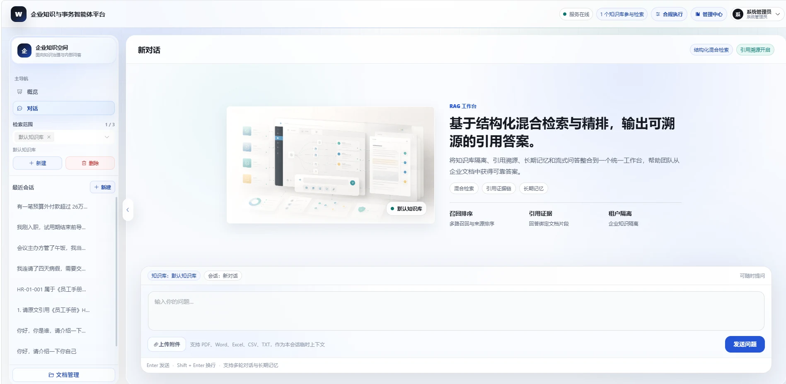 | 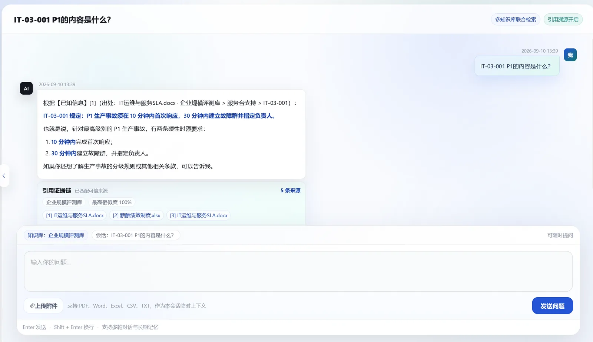 |
| 企业员工提问，支持附件与多轮追问 | 引用编号与来源区一一对应，可查看命中的知识库、文件名、片段与相似度 |

| 知识库治理 | 模型配置 |
| --- | --- |
| 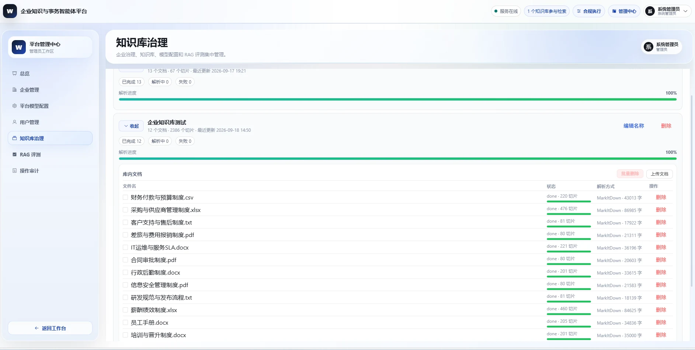 | 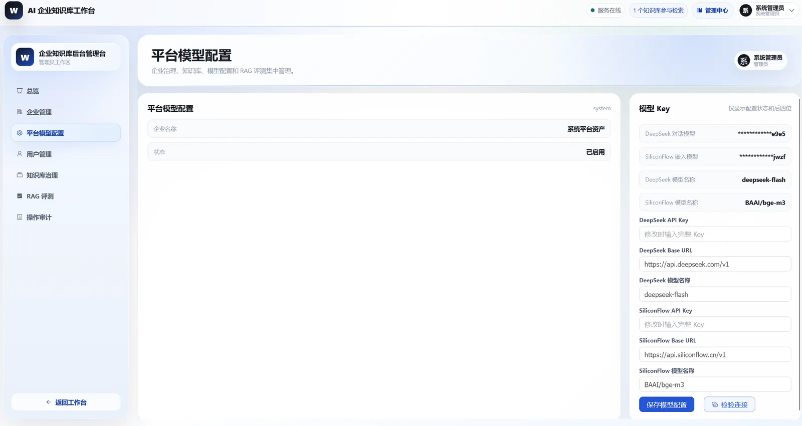 |
| 解析状态、切片数量与失败原因直接可见，支持批量删除 | Key 按企业加密保存、遮罩展示，保存与连接测试分离 |

| 会话附件 | RAG 评测中心 |
| --- | --- |
|  | 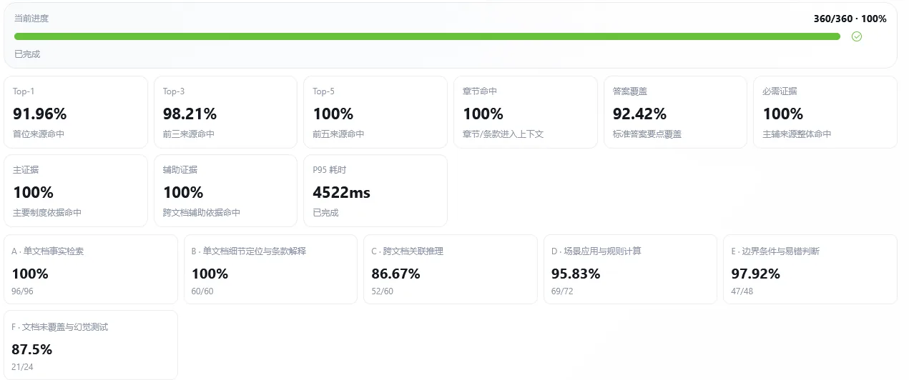 |
| 附件只在当前账号当前会话内参与回答，与知识库来源分组展示 | 题集管理、运行模式、逐题诊断与报告导出，任务按企业隔离 |

| 平台企业治理 | 企业用户管理 |
| --- | --- |
| 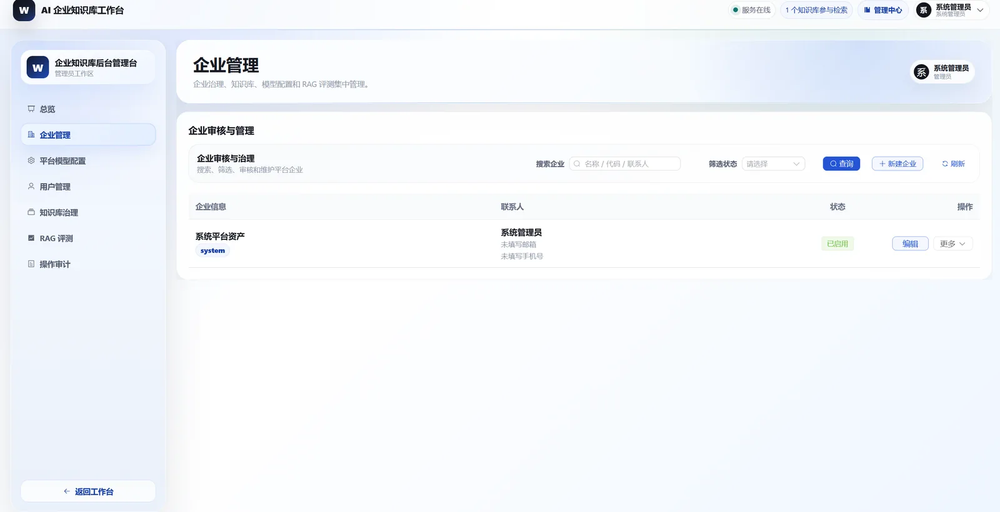 | 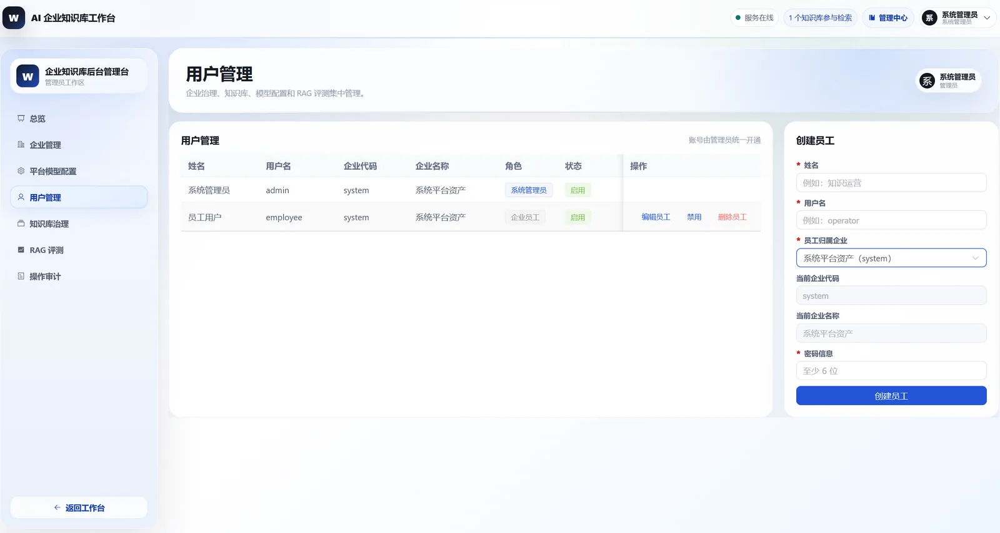 |
| 企业审核、启用禁用与软删除，治理动作全部写入审计日志 | 员工账号的创建、编辑、启停与删除，全部按企业隔离 |

| 事务工作台 | 人工审批中心 |
| --- | --- |
| 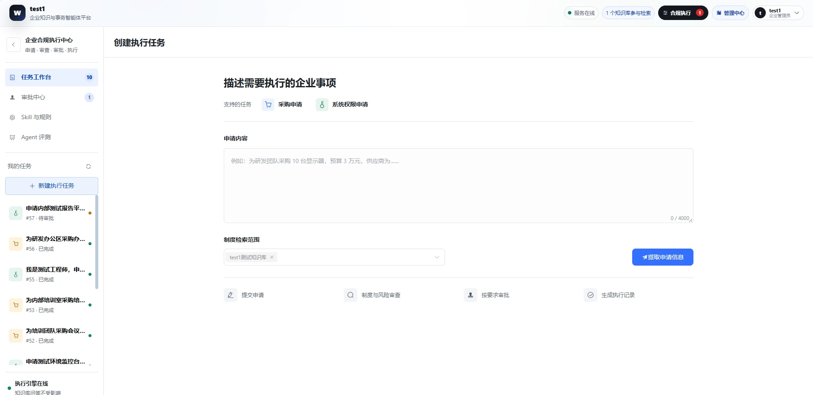 | 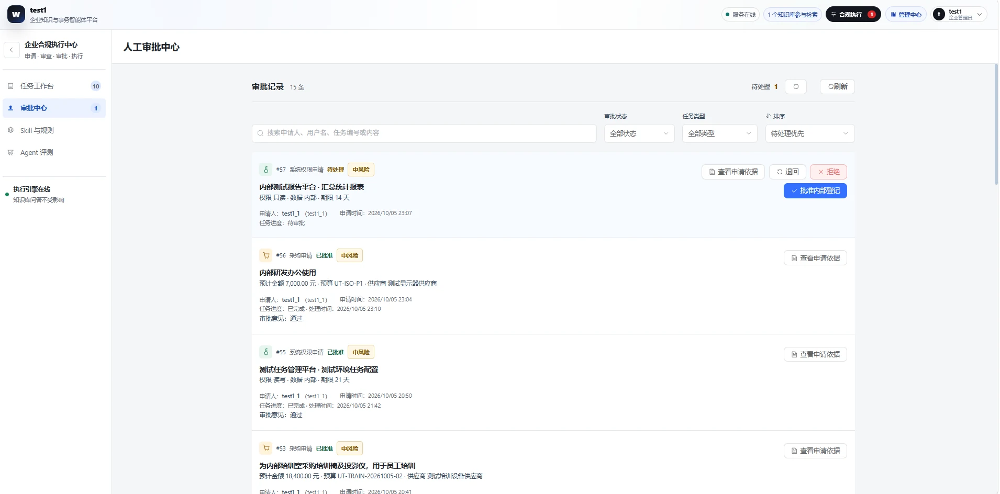 |
| 采购与权限两类申请走同一入口，先选制度检索范围，再抽取申请信息 | 待处理与历史决定分开显示；可批准登记、退回补充或拒绝，申请人本人无法自批 |

| 任务详情 · 受理与判定 | 任务详情 · 复核与登记 |
| --- | --- |
| 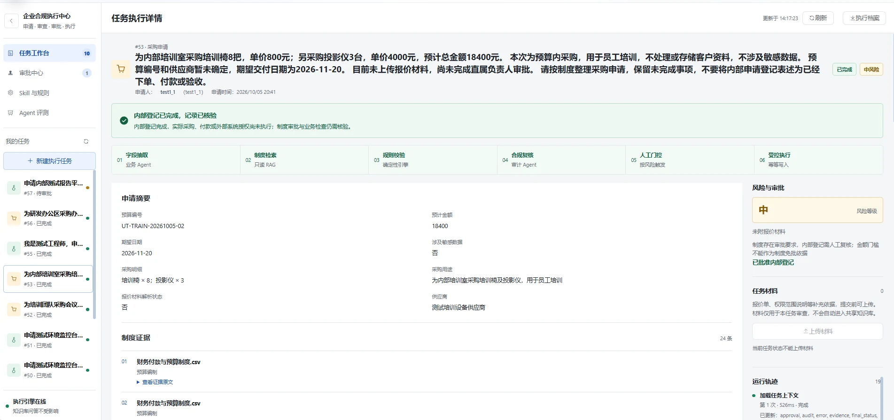 | 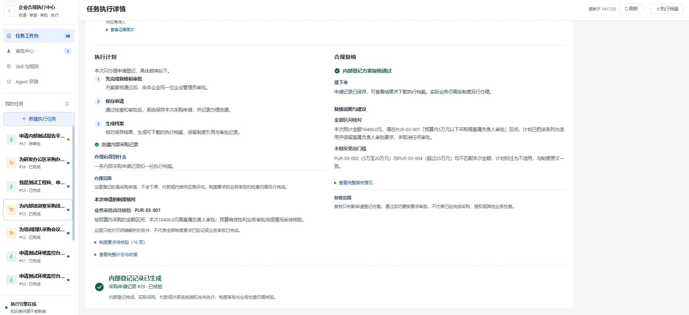 |
| 六阶段进度横向可查，下方是结构化申请字段、确定性风险与命中的制度证据 | 执行计划写明办理范围；独立复核逐项说明金额区间判定，并注明其余档位为何不适用 |

> 更多界面、检索链路与合规执行的实现说明见[项目展示页](https://jizhualiuliubei.github.io/RAG-Business-chat/)——点开是一个网页，图文介绍界面与实现，不用登录。

## 核心能力

| 能力 | 说明 |
| --- | --- |
| **多企业 SaaS** | 系统管理员、企业管理员、企业员工三类角色。企业注册、审核、启用禁用与软删除形成完整闭环，文档、会话、附件、评测任务与模型 Key 全部按企业隔离。 |
| **制度问答与引用溯源** | 用日常说法提问即可，系统检索出对应条款并生成回答，结论附 `[n]` 编号引用，能对回具体文件与片段。库里没有依据时明确说明未覆盖，不编造。 |
| **知识库与文档治理** | 知识库名称在企业内唯一，不同企业可使用同名知识库，数据仍按企业隔离。支持 DOCX、PDF、扫描 PDF（OCR）、TXT、CSV、XLSX、XLS。上传后自动解析、切片、入库；解析状态、切片数量与失败原因在后台直接可见，删除文档时同步清理向量。 |
| **模型配置** | 对话模型与嵌入模型的 Key 按企业配置、加密保存、遮罩展示，支持连接测试，并按企业路由。 |
| **会话附件** | 提问时可以临时上传附件，只属于当前账号当前会话，不进入企业知识库，来源与知识库证据分组展示。 |
| **RAG 评测中心** | 内置 360 题企业语料题集，支持检索评测、主评测、RAGAS 诊断、主评测+诊断四种模式，出逐题失败原因并可导出报告，任务与报告按企业隔离。 |
| **合规执行** | 采购与系统权限两类申请：抽字段 → 申请人核对确认 → 检索制度 → 生成计划 → 确定性规则检查 → 独立审计 →（按风险触发）企业管理员审批 → 写入内部登记记录。制度检索角度由模型自主决定；支持撤回与驳回，拦截自批与跨企业代批。 |
| **审计中心** | 企业审核、状态变更、Key 更新、文档与评测删除等关键动作可追踪。 |

## 效果指标

知识问答链路的评测：在自建的 360 题企业规模题集（12 份仿真制度文档）上，`rules` 模式主评测结果：

| 指标 | 结果 |
| --- | ---: |
| **端到端通过率**（不补召回，真实检索路径） | **93.89%** |
| 主评测总通过率（补召回后，生成端上限） | **97.78%** |
| **真实检索 Top-1 文档命中率**（不补召回） | **93.45%** |
| 评测题集 | **360 题**（A 到 F 六类题型） |

> 题集为**仿真企业语料自建**，用于验证检索与生成链路，不代表所有场景，也不能与公开基准直接比较。三个数字分别看不同环节：端到端通过率只用真实检索到的证据判定，总通过率允许先把证据补齐，Top-1 命中率衡量检索排序本身。题型分布与逐题明细见[项目展示页](https://jizhualiuliubei.github.io/RAG-Business-chat/)的评测章节。

## 快速开始

### 在线体验

**地址**：[http://118.31.45.253/](http://118.31.45.253/)

> 线上部署了**知识问答与管理**和**合规执行**两条链路；合规执行需要 Redis、Celery Worker 与 Beat，演示环境已开启，入口在顶部导航的「合规执行」。

#### 方式一：用演示账号看问答效果

1. 打开上面的地址，进入登录页。
2. 企业代码填 `system`，用户名填 `employee`，密码填 `employee123`，再输入算式验证码。
3. 点「登录工作台」进入问答页。
4. 在输入框里提一个制度类问题（考勤、报销、审批权限这类都可以）。
5. 看回答正文里的 `[1]`、`[2]` 编号，以及下方的引用来源区——每条编号都能对回具体的知识库、文件名、命中的片段和相似度。

| 企业代码 | 用户名 | 密码 | 角色 |
| --- | --- | --- | --- |
| `system` | `employee` | `employee123` | 员工演示账号；管理中心需管理员身份 |

> 这个账号看不到管理后台——想看后台用**方式二**。公开演示环境的账号与数据仅用于功能体验。

#### 方式二：注册体验账号，免审核进管理后台

如果你想看**管理后台**（知识库治理、模型配置、评测中心），又不想等审核，用这个：

1. 登录页底部点「**企业管理员体验账号注册**」（旁边还有一条「企业管理员注册申请」，那个需要审核）
2. 填写企业名称、企业代码、管理员用户名和密码——和正式申请是同一张表单
3. **提交后无需审核**，直接用「企业代码 + 用户名 + 密码」登录；登录后先到问答工作台，再从顶部导航进「管理中心」
4. 进「**企业设置**」填入你自己的模型 API Key —— **不配就无法问答**。用的是你自己的额度，不消耗演示环境的
5. 之后就能建知识库、传文档、提问，流程和正式企业一样

**体验账号的边界**（注册弹窗里也会写明）：

| | |
| --- | --- |
| 可以使用 | 知识库建设、文档上传、智能问答、企业设置、后台各页面浏览 |
| 需要你先做 | 在「企业设置」里配置你自己的模型 API Key |
| 暂不可用 | 创建子员工账号、RAG 评测中心、合规任务创建与任务材料上传（需平台管理员开通） |
| 数量上限 | 知识库 3 个、文档 20 份 |

#### 方式三：注册自己的企业，走一遍完整审核流程

如果你想走**正式注册**这条路（提交申请 → 平台审核 → 开通全部功能），按下面几步来：

1. **提交注册申请**：登录页底部点「企业管理员注册申请」，在弹出的表单里填写对应信息。

2. **等待审核**：提交后企业和管理员账号都处于**待审核**状态，此时还不能登录。平台管理员在「企业管理」里审核通过后，企业才会启用。

3. **登录**：用「企业代码 + 管理员用户名 + 密码」登录。所有角色登录后都先进入问答工作台；再从顶部导航进「管理中心」——里面有企业设置、知识库治理与 RAG 评测。

4. **配置模型 Key**：进「企业设置」，填入对话模型与嵌入模型的 Key，点「检验连接」确认可用。**没有配 Key 无法问答**。

5. **建设知识库**：进「知识库治理」，新建一个知识库，然后上传文档——支持 DOCX、PDF、扫描版 PDF（自动 OCR）、TXT、CSV、XLSX、XLS。上传后系统会自动解析、切片并写入向量库，页面上的解析状态和切片数量会实时更新，失败原因也会直接显示。

6. **回到问答工作台提问**：文档解析完成后，在问答页选中刚才的知识库提问，回答会带上引用来源。

7. **（可选）给同事开账号**：在「用户管理」里创建员工账号。员工登录后进入问答工作台，也能从「合规执行」提交申请；管理中心仅管理员可见。

> **方式三**的注册需要平台管理员**审核**，不会自动通过；想跳过审核用**方式二**。

## 技术栈

**后端** FastAPI · LangChain 1.2 · LangGraph（事务链路的状态图与人工中断恢复）· SQLAlchemy · Pydantic · MCP（工具接入协议） 
**模型** DeepSeek（对话与查询改写）· BGE-M3（向量化）· bge-reranker-v2-m3（重排） 
**文档解析** Microsoft MarkItDown（主解析）· python-docx / pypdf / openpyxl（降级）· Tesseract OCR（扫描件） 
**存储与队列** Zilliz / Milvus（向量）· SQLite / MySQL（关系）· Redis 8（队列、Checkpoint、事件、租约）· Celery（长任务与定时补派发） 
**前端** Vue 3 · Element Plus · Vite

---

**▶ [在线体验](http://118.31.45.253/)**　·　**📄 [项目展示页](https://jizhualiuliubei.github.io/RAG-Business-chat/)**

在线体验：打开线上系统，用体验账号直接提问　｜　项目展示页：打开网页看图文介绍

