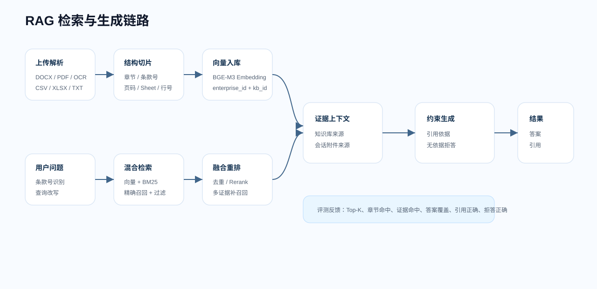

# RAG 机制说明

## 总体目标

本项目的 RAG 目标是企业制度问答的“可追溯正确”，不是简单的语义相似。企业资料中经常出现条款号、角色、金额、时间、审批节点和跨文档规则，普通向量 Top-K 容易出现三类问题：编号检索不稳定、跨文档证据被单一文档占满、相似但无依据的问题被误答。

因此系统把 RAG 拆成：解析、结构化切片、检索前优化、混合检索、融合重排、约束生成、评测反馈。



## 文档解析

### DOCX

DOCX 解析会读取正文段落和表格内容。段落文本用于保留制度条款、章节说明和流程描述；表格会转换为可检索文本，避免表格关系丢失。

处理重点：

- 保留文件名作为 `source`。
- 尝试识别标题、章节和条款号。
- 表格按行展开，保留表头字段和值。
- 空段落、重复空白和无意义控制字符会被清理。

### PDF 与扫描 PDF

PDF 优先走文本提取。如果文本提取为空或质量很差，则进入 OCR 兜底。扫描版 PDF 的关键风险是版面顺序、页眉页脚和 OCR 错字，因此系统会在解析结果中保留页码信息。

处理重点：

- 可复制文本 PDF：直接抽取文本。
- 扫描 PDF：渲染页面后 OCR。
- 解析阶段可保留页码信息，仅用于诊断，不写入切片。
- 解析失败时记录 `failure_reason`，前端可查看失败原因。

### CSV / XLSX

表格资料不能直接把单元格拼成一坨文本，否则模型很难知道字段和值的关系。系统会把表格转为结构化文本：每个工作表先写 `[工作表：{sheet名称}]` 前缀，再逐行按“表头：值”换行拼写。

```text
[工作表：绩效系数]
员工级别：P3
绩效等级：A
绩效系数：1.2
适用周期：年度绩效
```

这样做可以让关键词检索和向量检索同时命中“P3、绩效等级、系数、年度”等硬信息。

### TXT

TXT 资料直接读取文本并做编码兼容、空白清洗、章节识别和条款识别。制度类 TXT 通常结构清晰，适合保留标题和编号。

## 结构化切片

本项目的主切片策略是**整章独立成块**（`cut_by_heading`）：

1. 先按章节标题切分：文档有 Markdown 标题时按 `## 章节` 切；整篇没有 `## ` 标题时，才启用中文序号标题（如 `一、办公用品管理`）切分。
2. 再在章节内部按条款号正则 `[A-Z]{2}-\d{2}-\d{3}` 细分。
3. 每个 chunk 前拼接结构头 `来源：{文档名} > {章节} > {条款号}`，让文档名、章节名和条款号进入 embedding 与 BM25 文本。
4. 正文短于 20 字符的噪声块直接丢弃，避免产生“万能候选”垃圾块。

整章独立成块能保持章节语义完整、标题关键词参与打分；相比固定长度自然切分（会把多个不相关章节拼进同一块、稀释相似度、污染 BM25），更适合本项目的企业制度文档。

当单个章节超过 `MAX_CHAPTER_LEN=1200` 字符时，再交由 `RecursiveCharacterTextSplitter` 按 `CHUNK_SIZE` / `CHUNK_OVERLAP` 做二级细分：

| 参数 | 默认值 | 作用 |
| --- | ---: | --- |
| `CHUNK_SIZE` | 350 | 超长章节二级细分的每块目标字符数。 |
| `CHUNK_OVERLAP` | 80 | 超长章节二级细分时相邻块重叠字符数。 |
| `TOP_K` | 5 | 最终返回给生成模型的主要证据数量。 |
| `SCORE_THRESHOLD` | 0.45 | 低于阈值时倾向认为无相关知识库证据。 |
| `ENABLE_RERANK` | true | 是否启用重排。 |
| `RERANK_MODEL_NAME` | BAAI/bge-reranker-v2-m3 | 默认重排模型。 |

`350 + 80` 用于超长章节的二级细分：块太小会拆散条款正文、例外条件和处理动作，块太大又容易形成“万能候选块”，适中长度配合重叠更利于证据可读性。

每个 chunk 前写入结构头：

```text
来源：员工手册.docx > 入职管理 > HR-01-001
HR-01-001：新员工入职前必须完成身份核验、学历核验和保密承诺签署。
```

结构头的作用：

- 让条款号、章节和文档名进入 embedding 文本。
- 让 BM25 能直接命中文档名、章节名和编号。
- 让生成模型回答时能知道证据来源。
- 让评测系统能计算章节命中、主证据命中和辅助证据命中。

## 检索前优化

问题进入检索前会做轻量分析：

| 动作 | 目的 |
| --- | --- |
| 条款号识别 | 识别 `HR-01-001`、`PAY-07-001` 这类编号，触发精确召回。 |
| 文档名识别 | 用户提到《员工手册》时，提高该文档下内容的权重。 |
| 章节名识别 | 用户提到“入职管理”“绩效申诉”等章节时，提高章节匹配权重。 |
| 查询改写 | 把口语化问题改写成更接近制度文本的检索表达。 |

查询改写适合解决“用户说法”和“制度写法”不一致的问题。例如用户问“工资遇到假期怎么办”，制度可能写成“发薪日遇法定节假日顺延或提前发放”。改写可以补足制度关键词。

## 检索中优化

系统不是只使用向量检索，而是使用混合检索。

### 向量检索

使用 SiliconFlow/BGE-M3 生成 query embedding，到 Zilliz/Milvus 检索语义相近 chunk。向量检索适合召回同义表达、上下文相近的制度片段。

### BM25 / 关键词召回

BM25 适合召回编号、专有名词、金额、时间、角色、审批人等硬信息。这些信息在向量空间中不一定稳定，但在企业制度问答里非常关键。

### 条款号精确召回

如果问题中出现明确条款号，系统会优先寻找包含该条款号的 chunk。这样可以避免 `HR-01-001` 这类短编号被语义检索忽略。

### 元数据过滤

所有检索必须带企业和知识库过滤：

```text
enterprise_id = 当前企业
kb_id in 当前选择知识库
可选：doc_id in 当前有效文档
```

这既是权限隔离，也是防残留向量误命中的关键。

## 检索后优化

### 融合排序

向量检索和 BM25 返回的候选会融合排序。排序时综合考虑：

- 向量相似度。
- BM25 关键词分数。
- 条款号是否精确匹配。
- 文档名和章节名是否匹配。
- 是否来自当前知识库和当前企业。
- 是否重复或过度相似。

### 去重

同一个文档相邻 chunk 可能同时命中。系统会做去重和章节级压缩，避免 Top-K 被重复片段占满。

### Rerank

Rerank 用更强的相关性模型对候选重新排序。它适合解决“召回到了，但排序不靠前”的问题，尤其是跨文档、多条件、条款解释类问题。

## 会话附件 RAG

附件不进入企业知识库，而是作为当前账号当前会话的临时 RAG。

流程：

1. 用户在会话中上传附件。
2. 后端解析附件文本并生成摘要、字符数、切片数。
3. 切片写入 `conversation_attachment_chunk`。
4. 用户提问时同时检索企业知识库和会话附件。
5. 返回 `knowledge_base_sources` 和 `attachment_sources` 两类来源。

冲突处理：如果附件和企业知识库不一致，回答必须并列说明“知识库依据”和“附件显示”，不能擅自把附件覆盖为正式制度。

## 生成控制

Prompt 要求模型：

- 基于给定证据回答，不编造制度。
- 尽量给出结论、依据、处理动作、边界/例外和引用。
- 引用使用检索来源编号。
- 证据不足时明确说明知识库无依据。
- 区分企业正式知识库和会话附件。

制度类问答建议低温度，默认 `DEEPSEEK_TEMPERATURE=0.1`。低温度能减少随机发挥，提高评测可复现性。

## 评测反馈

RAG 评测中心会统计：Top-1/3/5 文档命中、章节命中、答案要点覆盖、必需证据、主证据、辅助证据、引用正确、拒答正确、耗时和 Token。

跨文档问题经常需要主证据和辅助证据。评测任务会针对每道题的必需引用做**多证据补召回**：把缺失的主证据或辅助证据从全库文本池中补齐并置于上下文前部，避免 Top-K 被单一文档占满。这一步在评测任务链路中执行，用于定位检索阶段的证据覆盖能力。

评测中心持续追踪跨文档答案要点覆盖和无依据拒答稳定性。后续可优化方向包括递归检索、多跳规划、独立裁判模型和更细粒度证据覆盖评分。
