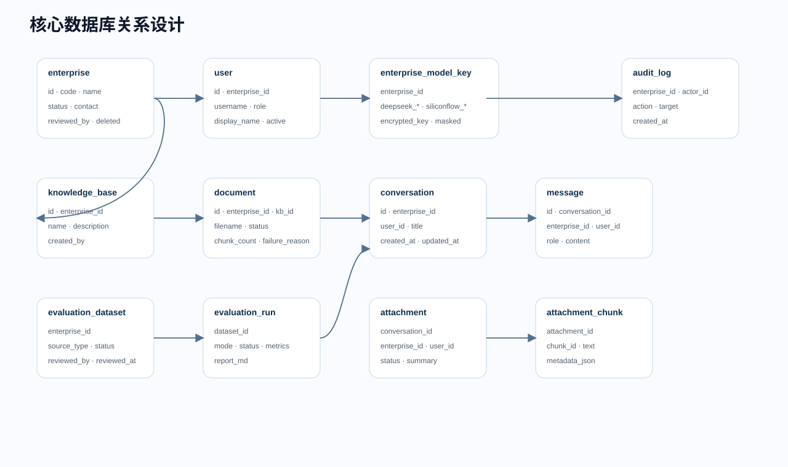

# 数据库设计

## 设计原则

RAG Business Chat 的数据库按多企业 SaaS 设计。核心原则是：企业级数据用 `enterprise_id` 隔离，个人会话数据再用 `user_id` 隔离，治理操作用审计日志追踪，企业删除采用软删除，模型 Key 加密保存且不向前端返回明文。

## 表关系总览

| 表 | 主关系 | 说明 |
| --- | --- | --- |
| `enterprise` | 租户根表 | 一个企业就是一个租户，`system` 也是一个平台资产租户。 |
| `users` | `enterprise_id -> enterprise.id` | 用户属于企业，用户名在企业内唯一。 |
| `enterprise_model_key` | `enterprise_id -> enterprise.id` | 每个企业一份模型配置。 |
| `knowledge_base` | `enterprise_id -> enterprise.id` | 知识库属于企业，名称在企业内唯一。 |
| `document` | `enterprise_id + kb_id` | 文档属于某企业某知识库。 |
| `conversation` | `enterprise_id + user_id` | 会话属于某企业某账号。 |
| `message` | `conversation_id + enterprise_id + user_id` | 消息跟随会话归属。 |
| `conversation_attachment` | `conversation_id + enterprise_id + user_id` | 会话附件只在当前账号当前会话可见。 |
| `conversation_attachment_chunk` | `attachment_id + conversation_id` | 附件临时切片，用于会话级 RAG。 |
| `user_profile` | `conversation_id` | 会话内长期用户档案。 |
| `evaluation_dataset` | `enterprise_id + version` | 评测集按企业隔离，版本在企业内唯一。 |
| `evaluation_dataset_case` | `enterprise_id + dataset_version` | 评测题目属于某企业某题集版本。 |
| `evaluation_run` | `enterprise_id + dataset_version` | 评测任务属于企业和创建账号。 |
| `evaluation_case_result` | `enterprise_id + run_id` | 单题评测结果。 |
| `audit_logs` | `enterprise_id + actor_id` | 关键治理操作审计。 |

## enterprise

企业租户表，系统平台资产也作为一条企业记录存在，企业代码为 `system`。

| 字段 | 类型/约束 | 说明 |
| --- | --- | --- |
| `id` | PK | 企业 ID。 |
| `name` | `String(120)` | 企业名称，必填。 |
| `code` | `String(60)`, unique, index | 企业代码，登录和租户识别使用，唯一。 |
| `status` | `String(30)` | 企业状态：`pending_review`、`active`、`rejected`、`disabled`、`deleted`。 |
| `logo_url` | `String(500)` | 企业 Logo 地址，可空。 |
| `theme_color` | `String(30)` | 企业主题色，默认 `#2563eb`。 |
| `contact_name` | `String(80)` | 联系人。 |
| `contact_email` | `String(120)` | 联系邮箱。 |
| `contact_phone` | `String(50)` | 联系电话。 |
| `reviewed_by` | FK `users.id` | 审核人。 |
| `reviewed_at` | DateTime | 审核时间。 |
| `reject_reason` | `String(500)` | 拒绝原因。 |
| `created_at` / `updated_at` | DateTime | 创建和更新时间。 |

状态流转：企业管理员注册后进入 `pending_review`；系统管理员可通过为 `active`，拒绝为 `rejected`，禁用为 `disabled`，删除为 `deleted`。删除是软删除，不级联清空业务数据。

## users

用户表，支持系统管理员、企业管理员、企业员工三类角色。

| 字段 | 类型/约束 | 说明 |
| --- | --- | --- |
| `id` | PK | 用户 ID。 |
| `enterprise_id` | FK `enterprise.id` | 用户所属企业。 |
| `username` | `String(80)`, index | 登录用户名。 |
| `password_hash` | `String(255)` | 密码摘要，不存明文。 |
| `display_name` | `String(120)` | 页面展示姓名。 |
| `role` | `String(30)` | `system_admin`、`enterprise_admin`、`employee`。 |
| `status` | `String(30)` | 用户状态，默认 `active`。 |
| `created_at` | DateTime | 创建时间。 |
| `last_login_at` | DateTime | 最近登录时间。 |

唯一约束：`enterprise_id + username`。因此不同企业可以都有 `admin` 或 `employee`，登录时用企业代码区分。

## enterprise_model_key

企业模型配置表。普通企业用户调用模型时只读取本企业配置；`system` 平台资产读取 `system` 企业配置。

| 字段 | 类型/约束 | 说明 |
| --- | --- | --- |
| `id` | PK | 配置 ID。 |
| `enterprise_id` | FK, unique | 一个企业一份模型配置。 |
| `deepseek_api_key_encrypted` | `String(2000)` | DeepSeek Key 加密密文。 |
| `deepseek_base_url` | `String(500)` | DeepSeek Base URL。 |
| `deepseek_model` | `String(100)` | 对话模型名。 |
| `deepseek_key_last4` | `String(4)` | 前端展示后四位。 |
| `siliconflow_api_key_encrypted` | `String(2000)` | SiliconFlow Key 加密密文。 |
| `siliconflow_base_url` | `String(500)` | SiliconFlow Base URL。 |
| `embed_model_name` | `String(100)` | 嵌入模型名，默认 BGE-M3。 |
| `siliconflow_key_last4` | `String(4)` | 前端展示后四位。 |
| `updated_by` | FK `users.id` | 最近更新人。 |
| `created_at` / `updated_at` | DateTime | 创建和更新时间。 |

安全规则：查询接口只返回是否已配置、后四位、Base URL 和模型名；更新时必须重新输入完整 Key；审计日志不记录 Key 明文。

## knowledge_base

知识库表。

| 字段 | 类型/约束 | 说明 |
| --- | --- | --- |
| `id` | PK | 知识库 ID。 |
| `enterprise_id` | FK | 所属企业。 |
| `name` | `String(200)` | 知识库名称。 |
| `created_at` | DateTime | 创建时间。 |

唯一约束：`enterprise_id + name`。不同企业可以都有“默认知识库”。

## document

文档表，记录上传文件的解析状态和入库结果。

| 字段 | 类型/约束 | 说明 |
| --- | --- | --- |
| `id` | PK | 文档 ID。 |
| `enterprise_id` | FK | 所属企业。 |
| `kb_id` | Integer | 所属知识库。 |
| `filename` | `String(255)` | 原始文件名。 |
| `file_size` | Integer | 文件大小。 |
| `status` | `String(20)` | `processing`、`done`、`failed`。 |
| `failure_reason` | `String(1000)` | 解析或入库失败原因。 |
| `chunk_count` | Integer | 切片数量。 |
| `created_at` | DateTime | 上传时间。 |

文档删除时需要同步删除 Zilliz 中 `enterprise_id + kb_id + doc_id` 匹配的向量，避免残留向量被后续检索命中。

## conversation 与 message

会话和消息是个人数据。即使企业管理员和员工属于同一企业，也不能共享最近会话。

`conversation`：

| 字段 | 类型/约束 | 说明 |
| --- | --- | --- |
| `id` | PK | 会话 ID。 |
| `enterprise_id` | FK | 所属企业。 |
| `user_id` | FK `users.id` | 所属账号。 |
| `title` | `String(200)` | 会话标题。 |
| `created_at` / `updated_at` | DateTime | 创建和更新时间。 |

`message`：

| 字段 | 类型/约束 | 说明 |
| --- | --- | --- |
| `id` | PK | 消息 ID。 |
| `enterprise_id` | FK | 所属企业。 |
| `user_id` | FK | 所属账号。 |
| `conversation_id` | Integer | 所属会话。 |
| `role` | `String(20)` | `user` 或 `assistant`。 |
| `content` | Text | 消息正文。 |
| `sources` | Text JSON | assistant 消息的引用来源。 |
| `model_name` | `String(100)` | 模型名。 |
| `usage` | Text JSON | Token 用量。 |
| `created_at` | DateTime | 创建时间。 |

后端读取、写入、删除会话时必须同时校验 `enterprise_id + user_id + conversation_id`。

## conversation_attachment 与 conversation_attachment_chunk

会话附件是“当前账号当前会话”的临时 RAG，不进入企业知识库。

`conversation_attachment`：

| 字段 | 类型/约束 | 说明 |
| --- | --- | --- |
| `id` | PK | 附件 ID。 |
| `enterprise_id` | FK | 所属企业。 |
| `user_id` | FK | 所属账号。 |
| `conversation_id` | index | 所属会话。 |
| `filename` | `String(255)` | 原始文件名。 |
| `stored_path` | `String(500)` | 文件保存路径。 |
| `content` | Text | 解析文本。 |
| `status` | `String(20)` | `processing`、`done`、`failed`。 |
| `failure_reason` | `String(1000)` | 失败原因。 |
| `summary` | Text | 附件摘要。 |
| `chunk_count` | Integer | 附件切片数。 |
| `content_chars` | Integer | 解析字符数。 |
| `file_size` | Integer | 文件大小。 |
| `created_at` | DateTime | 上传时间。 |

`conversation_attachment_chunk`：

| 字段 | 类型/约束 | 说明 |
| --- | --- | --- |
| `id` | PK | 切片记录 ID。 |
| `enterprise_id` | FK | 所属企业。 |
| `user_id` | FK | 所属账号。 |
| `conversation_id` | index | 所属会话。 |
| `attachment_id` | index | 所属附件。 |
| `chunk_id` | Integer | 附件内切片序号。 |
| `source` | `String(255)` | 文件名。 |
| `source_type` | `String(30)` | 固定为 `attachment`。 |
| `text` | Text | 切片文本。 |
| `metadata_json` | Text JSON | 页码、Sheet、行号等元数据。 |
| `created_at` | DateTime | 创建时间。 |

删除附件时清理文件、附件记录和附件切片；删除会话时同步清理该会话下的附件和档案。

## user_profile

用户档案表，用于会话内长期记忆。

| 字段 | 类型/约束 | 说明 |
| --- | --- | --- |
| `id` | PK | 档案 ID。 |
| `conversation_id` | unique | 一个会话一份档案。 |
| `fields` | Text JSON | 结构化记忆，例如姓名、称呼、身份、偏好。 |
| `updated_at` | DateTime | 更新时间。 |

当前长期记忆以会话为单位，不跨账号、不跨企业共享。

## evaluation_dataset 与 evaluation_dataset_case

评测集与题目表。

`evaluation_dataset`：

| 字段 | 说明 |
| --- | --- |
| `enterprise_id` | 所属企业。 |
| `version` | 题集版本，企业内唯一。 |
| `name` | 题集名称。 |
| `source_type` | `builtin`、`uploaded`、`ai_generated`、`human_reviewed`。 |
| `status` | `draft`、`approved` 等状态。 |
| `description` | 题集说明。 |
| `recommended_kb_name` | 推荐知识库名称。 |
| `reviewed_by` / `reviewed_at` | 审核人和审核时间。 |
| `review_notes` | 审核说明。 |
| `generation_policy` | AI 生成策略 JSON。 |
| `created_by` / `created_by_name` | 创建人。 |

`evaluation_dataset_case`：

| 字段 | 说明 |
| --- | --- |
| `case_id` | 题号。 |
| `category` | 题型分类，视题集版本而定（360 题为 A–F，其余为 A–E）。 |
| `difficulty` | 难度。 |
| `question` | 问题。 |
| `expected_doc` | 期望文档。 |
| `expected_section` | 期望章节。 |
| `expected_clause` | 期望条款。 |
| `expected_keywords_json` | 期望关键词。 |
| `standard_answer` | 标准答案。 |
| `answer_points_json` | 答案要点。 |
| `required_citations_json` | 必需引用。 |
| `evaluation_focus` | 评分关注点。 |
| `negative_case` | 负例标记，仅 360 题集（`enterprise_scale_360_v1`）中属 F 类，共 24 题。 |
| `evidence_text` / `evidence_hash` | AI 辅助题集的证据快照。 |
| `source_chunk_id` | 来源切片。 |
| `generation_confidence` | 生成置信度。 |
| `review_status` | 单题审核状态。 |

## evaluation_run 与 evaluation_case_result

评测任务和逐题结果。

`evaluation_run` 保存任务级信息：企业、知识库、题集版本、模式、状态、创建人、开始结束时间、耗时、汇总 JSON、错误信息。

`evaluation_case_result` 保存单题诊断：检索上下文、模型答案、引用、是否通过、Top-K 命中、章节命中、答案覆盖、拒答正确、耗时、Token、失败原因和修复建议。

这两个表让系统可以展示任务历史、逐题诊断、失败样例和 Markdown 报告。

## audit_logs

审计日志表。

| 字段 | 说明 |
| --- | --- |
| `enterprise_id` | 操作影响的企业。 |
| `actor_id` / `actor_name` | 操作人。 |
| `action` | 操作类型，如审核企业、更新 Key、删除文档。 |
| `target_type` / `target_name` | 操作对象。 |
| `result` | 操作结果。 |
| `created_at` | 操作时间。 |

审计日志用于平台治理追踪，尤其是企业审核、代管、禁用、Key 更新、删除等高风险操作。

## Zilliz 向量元数据

向量数据不放在关系库，而是写入 Zilliz/Milvus。每条向量至少需要以下元数据：

| 字段 | 说明 |
| --- | --- |
| `enterprise_id` | 企业租户边界。 |
| `kb_id` | 知识库边界。 |
| `doc_id` | 文档边界。 |
| `source` | 来源文件名。 |
| `chunk_id` | 切片序号。 |
| `text` | 带结构头的切片正文。 |

章节名和条款号不是独立字段，而是拼进 `text` 的结构头（`来源：{文档名} > {章节} > {条款号}`）。

检索、删除、统计都必须带 `enterprise_id + kb_id/doc_id` 过滤条件。这是防止跨企业泄漏和残留向量误命中的关键。
